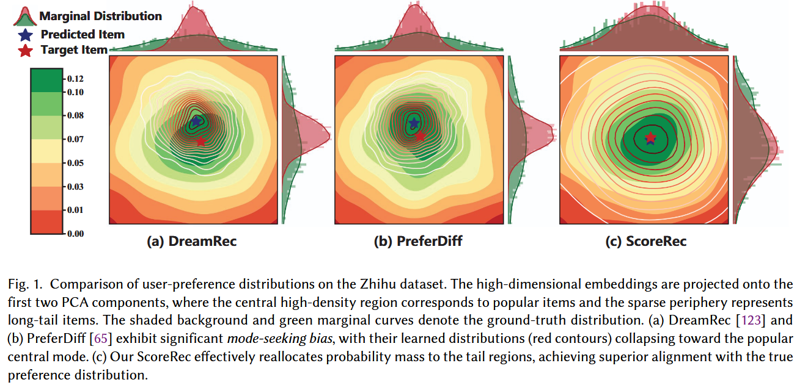
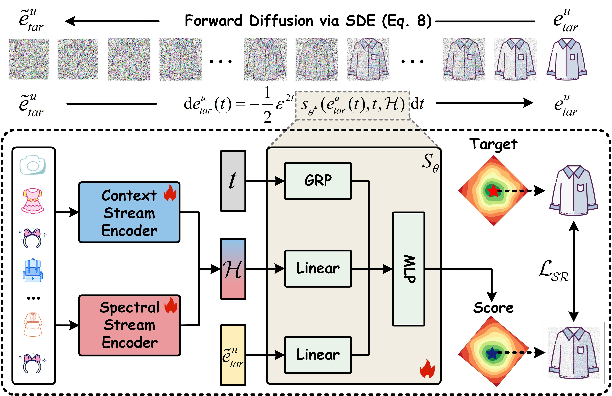

<div align="center">


# ScoreRec

### Reallocating Probability Mass in Sequential Recommendation via Score-based Diffusion Modeling

**ACM Transactions on Information Systems (TOIS), 2026**

**Peng He · Yao Liu · Tong Luo · Yanglei Gan · Tingting Dai · Run Lin · Qiao Liu\***  
University of Electronic Science and Technology of China (UESTC)

[](https://dl.acm.org/doi/10.1145/3831688)
[](https://doi.org/10.1145/3831688)
[](https://github.com/AONE-NLP/ScoreRec)
[](https://pytorch.org/)
[](https://dl.acm.org/doi/10.1145/3831688)

[**Paper**](https://dl.acm.org/doi/10.1145/3831688) ·
[**PDF**](https://dl.acm.org/doi/pdf/10.1145/3831688) ·
[**Google Scholar**](https://scholar.google.com/citations?user=uFJBSZEAAAAJ&hl=zh-CN&authuser=1) ·
[**Code**](https://github.com/AONE-NLP/ScoreRec) ·
[**Quick Start**](#-quick-start) ·
[**Citation**](#-citation)

</div>

---

> **Official PyTorch implementation of ScoreRec.**  
> ScoreRec reformulates sequential recommendation as a **continuous-time score-based generative process**, explicitly targeting the distributional misalignment and mode-seeking bias of conventional diffusion-based recommenders.

## 📰 News

- **2026-05-16** — ScoreRec was published online in **ACM Transactions on Information Systems (TOIS)**. [DOI: 10.1145/3831688](https://doi.org/10.1145/3831688)
- **2026** — Official implementation released at [AONE-NLP/ScoreRec](https://github.com/AONE-NLP/ScoreRec).

## 📌 Table of Contents

- [Overview](#-overview)
- [Motivation](#-motivation)
- [Method](#-method)
- [Key Contributions](#-key-contributions)
- [Experimental Results](#-experimental-results)
- [Datasets](#-datasets)
- [Quick Start](#-quick-start)
- [Reproducing the Paper](#-reproducing-the-paper)
- [Evaluation Protocol](#-evaluation-protocol)
- [Repository Layout](#-repository-layout)
- [Reproducibility Notes](#-reproducibility-notes)
- [Citation](#-citation)
- [Acknowledgements](#-acknowledgements)
- [Funding](#-funding)
- [Contact](#-contact)

---

## 🔍 Overview

Sequential recommendation aims to predict the next item a user will interact with from their historical interaction sequence. Recent diffusion-based recommenders improve expressive power by modeling a distribution over potential next items, but their denoising trajectories can still be dominated by high-frequency interactions. This creates **distributional misalignment**: probability mass is pulled toward popular modes, while low-frequency yet personally relevant items are underrepresented.

**ScoreRec** addresses this problem with three tightly coupled ideas:

1. **Continuous-time score-based generation.** Instead of relying on a fixed discrete denoising schedule, ScoreRec models corruption with a stochastic differential equation (SDE) and learns the score function—the gradient of the log-density—over the item-embedding manifold.
2. **Dual-stream historical encoding.** A Transformer-based **Context Stream Encoder** captures contextual dependencies, while a DFT-based **Spectral Stream Encoder** separates low- and high-frequency preference signals for long- and short-term interest modeling.
3. **Adaptive probability-flow ODE inference.** At inference time, the learned conditional score field guides a probability-flow ordinary differential equation (PF-ODE) to recover a clean target-item embedding, which is then ranked against candidate item embeddings.

In short, ScoreRec is designed not only to improve top-K accuracy, but also to **reallocate probability mass toward sparse and long-tail regions of the preference space**, yielding broader and more diverse recommendation coverage.

---

## 💡 Motivation

<p align="center">
  
</p>


Conventional diffusion-based sequential recommenders can exhibit **mode-seeking bias**: learned distributions concentrate around dense popular-item regions, shifting predictions away from a user's true personalized optimum. ScoreRec instead learns a continuous score field that better covers low-density regions and reallocates probability mass toward less frequent but relevant items.

The motivation figure compares the learned user-preference distributions of **DreamRec**, **PreferDiff**, and **ScoreRec** on Zhihu. The first two methods show stronger concentration around the popular central mode, whereas ScoreRec produces a distribution that is better aligned with the target preference distribution.

---

## 🧠 Method

<p align="center">
  
</p>


ScoreRec converts next-item prediction into a conditional continuous-time generation problem.

### 1. Dual-stream historical interaction encoder

Given a user's interaction sequence, ScoreRec constructs a unified condition representation from two complementary branches:

- **Context Stream Encoder** — uses self-attention to model contextual and long-range sequential dependencies.
- **Spectral Stream Encoder** — applies the Discrete Fourier Transform (DFT), decomposing sequential representations into low-frequency and high-frequency components that capture smoother long-term preferences and rapidly changing short-term interests, respectively.

The contextual, low-frequency, and high-frequency representations are concatenated to form the final historical condition.

### 2. Continuous-time denoising score matching

The target-item embedding is perturbed through an SDE with a continuous noise schedule. Instead of directly predicting a discrete denoising transition, ScoreRec trains a neural score network to approximate the gradient of the conditional log-density over noisy target embeddings.

This continuous formulation supplies valid training signals across the embedding manifold, including sparse regions associated with long-tail items.

### 3. Probability-flow ODE sampling

During inference, ScoreRec replaces stochastic reverse-SDE sampling with the corresponding **probability-flow ODE**. The public implementation uses SciPy's adaptive `solve_ivp` integrator (`RK45`), allowing the solver to automatically adjust step sizes according to the local geometry of the learned score field.

### 4. Generation and ranking

After ODE sampling, ScoreRec obtains a generated target embedding. Candidate scores are computed by inner product with the item-embedding matrix, and the top-K items are returned as recommendations.

---

## ✨ Key Contributions

- **Score-based sequential recommendation.** ScoreRec introduces a continuous-time score-based generative framework for sequential recommendation and directly estimates log-density gradients over the item-embedding manifold.
- **Probability-mass reallocation.** The method is explicitly designed to mitigate diffusion-model mode-seeking bias and improve coverage of low-frequency, personally relevant items.
- **Context + spectral conditional guidance.** A dual-stream encoder combines Transformer-based contextual modeling with DFT-derived long-/short-term preference signals.
- **Accuracy-efficiency balance.** Adaptive PF-ODE sampling provides deterministic generation with a favorable trade-off between recommendation quality and inference cost.
- **Broad empirical validation.** Experiments compare ScoreRec with eleven strong baselines and evaluate accuracy, diversity, long-tail behavior, cross-domain generalization, ablations, sensitivity, and efficiency.

---

## 📊 Experimental Results

### Overall recommendation accuracy

The table below summarizes the principal results reported for the three main benchmarks. Values are percentages, and **Improve.** denotes relative improvement over the strongest competing baseline reported in the paper.

| Dataset           |      HR@5 | Improve. |     HR@10 | Improve. |    NDCG@5 | Improve. |   NDCG@10 | Improve. |
| ----------------- | --------: | -------: | --------: | -------: | --------: | -------: | --------: | -------: |
| Zhihu             | **0.927** |   +3.23% | **1.392** |   +7.82% | **0.616** |   +2.50% | **0.702** |   +6.53% |
| YooChoose         | **2.739** |  +27.93% | **3.498** |   +8.47% | **2.051** |  +32.66% | **2.143** |  +16.21% |
| Sports & Outdoors | **2.002** |  +13.04% | **2.427** |  +11.79% | **1.529** |   +4.51% | **1.663** |   +8.06% |

The largest gains appear on **YooChoose**, where ScoreRec improves HR@5 by **27.93%** and NDCG@5 by **32.66%** over the strongest baseline in the reported comparison.

### Recommendation diversity

ScoreRec is evaluated with both intra-list and aggregate diversity metrics.

| Dataset           |  ILD-E@5 ↑ |  Gini@5 ↓ |
| ----------------- | ---------: | --------: |
| Zhihu             | **10.997** | **0.499** |
| YooChoose         | **11.819** | **0.845** |
| Sports & Outdoors |     77.620 | **0.571** |

ScoreRec achieves the lowest reported Gini@5 on all three datasets and the highest ILD-E@5 on two of the three datasets, supporting the central claim that continuous score modeling can broaden exposure beyond dominant popularity modes.

### Inference efficiency

The paper also evaluates adaptive PF-ODE sampling against alternative samplers. Reported ScoreRec inference time is:

| Dataset           | Inference time (s/epoch) | Average HR@K | Average NDCG@K |
| ----------------- | -----------------------: | -----------: | -------------: |
| Zhihu             |               **30.350** |        2.087 |          0.852 |
| YooChoose         |              **113.760** |        5.207 |          2.279 |
| Sports & Outdoors |               **67.305** |        2.800 |          1.737 |

On Zhihu, for example, the paper reports 30.35 s/epoch for ScoreRec versus 281.218 s/epoch for DiffuRec under the same GPU family used in the experiments.

> For complete comparisons, standard deviations, significance tests, ablations, cross-domain experiments, long-tail evaluation, sensitivity analysis, and FLOP/parameter measurements, please refer to the [full paper](https://dl.acm.org/doi/10.1145/3831688).

---

## 🗃️ Datasets

ScoreRec is evaluated on Zhihu, YooChoose, and multiple Amazon 2018 domains.

| Dataset                | # Sequences | # Items | # Interactions | Role in the paper  |
| ---------------------- | ----------: | ------: | -------------: | ------------------ |
| Zhihu                  |      11,714 |   4,838 |         77,712 | Main benchmark     |
| YooChoose              |     128,468 |   9,514 |        539,436 | Main benchmark     |
| Sports & Outdoors      |      35,598 |  18,357 |        296,337 | Main benchmark     |
| CDs & Vinyl            |     112,379 |  15,520 |        457,589 | Cross-domain study |
| Automotive             |     193,651 |  18,703 |        806,939 | Cross-domain study |
| Grocery & Gourmet Food |     127,496 |  11,778 |        623,940 | Cross-domain study |
| Musical Instruments    |      27,530 |   2,494 |        110,151 | Cross-domain study |
| Office Products        |     101,501 |   8,623 |        452,415 | Cross-domain study |

### Data sources

- **Preprocessed Zhihu / YooChoose data used by related diffusion work:** [DreamRec data directory](https://github.com/YangZhengyi98/DreamRec/tree/main/data)
- **YooChoose / RecSys Challenge 2015:** [Challenge page](https://recsys.acm.org/recsys15/challenge/)
- **Amazon Review Data (2018):** [UCSD Amazon Review Data](https://cseweb.ucsd.edu/~jmcauley/datasets/amazon_v2/)

The paper follows a chronological **8:1:1** train/validation/test split. For validation and testing, the last ten interactions are used as the input sequence; shorter sequences are padded and masked.

### Expected local data layout

The public training script reads data relative to the working directory:

```text
ScoreRec/
└── ScoreRec/
    └── data/
        ├── zhihu/
        │   ├── data_statis.df
        │   ├── train_data.df
        │   ├── val_data.df
        │   └── test_data.df
        ├── yc/
        │   └── ...
        └── sports_and_outdoors/
            └── ...
```

---

## 🚀 Quick Start

### 1. Clone the repository

```bash
git clone https://github.com/AONE-NLP/ScoreRec.git
cd ScoreRec/ScoreRec
```

### 2. Create an isolated environment

A Python version compatible with PyTorch 1.13 is recommended. One practical setup is:

```bash
conda create -n scorerec python=3.9 -y
conda activate scorerec
```

### 3. Install dependencies

The repository currently pins:

```text
torch==1.13.0+cu117
tensorboard==2.13.0
scipy==1.10.1
```

For CUDA 11.7, a robust installation sequence is:

```bash
pip install torch==1.13.0+cu117 \
  --extra-index-url https://download.pytorch.org/whl/cu117

pip install tensorboard==2.13.0 scipy==1.10.1 numpy pandas tqdm
```

The second line includes packages directly imported by the released implementation (`numpy`, `pandas`, and `tqdm`) so that a fresh environment is less likely to fail on missing transitive dependencies.

### 4. Verify the environment

```bash
python - <<'PY'
import torch, scipy, pandas, numpy
print("PyTorch:", torch.__version__)
print("CUDA available:", torch.cuda.is_available())
print("CUDA version:", torch.version.cuda)
PY
```

The experiments reported in the paper were run on Linux with an **NVIDIA RTX 4090 (24 GB)** GPU.

---

## 🔬 Reproducing the Paper

The commands below explicitly spell out the best hyperparameters reported in the paper, avoiding dependence on defaults.

> **Important:** run the commands from `ScoreRec/ScoreRec/`, because the released script uses relative paths such as `./data/<dataset>` and `./logs/...`.

### Zhihu

```bash
python ScoreRec.py \
  --Model ScoreRec \
  --data zhihu \
  --batch_size 128 \
  --hidden_size 64 \
  --lr 0.001 \
  --sigma 0.2 \
  --sampler ode_sampler \
  --rtol 0.00001 \
  --atol 0.00001 \
  --diffuser_type mlp1 \
  --num_head 1 \
  --InfoNCE False \
  --alpha 0.9 \
  --temperature 0.1 \
  --z 4
```

### YooChoose

```bash
python ScoreRec.py \
  --Model ScoreRec \
  --data yc \
  --batch_size 256 \
  --hidden_size 64 \
  --lr 0.001 \
  --sigma 0.3 \
  --sampler ode_sampler \
  --rtol 0.001 \
  --atol 0.001 \
  --diffuser_type mlp1 \
  --num_head 1 \
  --InfoNCE False \
  --alpha 0.9 \
  --temperature 0.1 \
  --z 3
```

### Sports & Outdoors

```bash
python ScoreRec.py \
  --Model ScoreRec \
  --data sports_and_outdoors \
  --batch_size 256 \
  --hidden_size 3072 \
  --lr 0.00005 \
  --sigma 0.18 \
  --sampler ode_sampler \
  --rtol 0.001 \
  --atol 0.001 \
  --diffuser_type mlp1 \
  --num_head 1 \
  --InfoNCE False \
  --alpha 0.9 \
  --temperature 0.1 \
  --z 3
```

### Paper-reported best hyperparameters

| Dataset           | Batch size | Learning rate | Embedding dim. `D` | DFT cutoff `z` | Noise intensity | `atol` | `rtol` |
| ----------------- | ---------: | ------------: | -----------------: | -------------: | --------------: | -----: | -----: |
| Zhihu             |        128 |          1e-3 |                 64 |              4 |            0.20 |   1e-5 |   1e-5 |
| YooChoose         |        256 |          1e-3 |                 64 |              3 |            0.30 |   1e-3 |   1e-3 |
| Sports & Outdoors |        256 |          5e-5 |               3072 |              3 |            0.18 |   1e-3 |   1e-3 |

In the released code, `--sigma` is the command-line name used for the continuous noise intensity parameter. The default random seed is `100`, the default optimizer is `AdamW`, and L2 weight decay defaults to `1e-8`.

---

## 📏 Evaluation Protocol

ScoreRec evaluates top-K recommendation at:

```text
K ∈ {5, 10, 20, 50}
```

The paper reports four principal metrics:

| Metric  | Direction | Interpretation                                               |
| ------- | :-------: | ------------------------------------------------------------ |
| HR@K    |     ↑     | Whether the target item appears in the top-K recommendation list |
| NDCG@K  |     ↑     | Ranking quality with stronger reward for placing the target item near the top |
| ILD-E@K |     ↑     | Intra-list diversity measured with Euclidean distance between recommended item embeddings |
| Gini@K  |     ↓     | Aggregate exposure inequality across recommended items; lower indicates more balanced exposure |

The released `ScoreRec.py` evaluation path directly prints **HR**, **NDCG**, and **Gini** values and writes corresponding TensorBoard scalars.

---

## 🧩 Repository Layout

```text
ScoreRec/
├── README.md
└── ScoreRec/
    ├── ScoreRec.py          # Main training / evaluation entry point
    ├── Modules_ori.py       # Attention and feed-forward building blocks
    ├── utility.py           # Metrics and utility functions
    ├── requirements.txt     # Core pinned dependencies
    ├── data/                # Dataset folders / preprocessed files
    └── figure/
        ├── Motivation.png   # Distributional-misalignment motivation
        └── model.jpg        # ScoreRec architecture
```

At runtime, the current script also writes TensorBoard logs under `./logs/` and creates a `./pth/` directory. The checkpoint-saving lines in the released script are commented out by default; enable them if you want persistent checkpoints during training.

---

## ✅ Reproducibility Notes

For a clean reproduction, please check the following before opening an issue:

- **Run from the correct directory.** The script assumes `ScoreRec/ScoreRec/` as the working directory.
- **Use the paper-aligned embedding dimension.** The Sports & Outdoors result uses `D = 3072`, which is substantially larger than the 64-dimensional setting used for Zhihu and YooChoose.
- **Keep solver tolerances explicit.** `rtol` and `atol` directly affect the adaptive PF-ODE solver and can change the accuracy/speed trade-off.
- **Match the dataset directory name.** The released command uses `yc` for YooChoose and `sports_and_outdoors` for Sports & Outdoors.
- **Control randomness.** The script exposes `--random_seed` and defaults to `100`.
- **Check GPU memory for Sports.** The 3072-dimensional Sports configuration is significantly heavier than the 64-dimensional configurations.
- **Inspect TensorBoard logs.** Training/validation/test metrics are logged under `./logs/` and can be visualized with:

```bash
tensorboard --logdir ./logs
```

---

## 📝 Citation

If you find ScoreRec useful in your research, please cite our paper:

```bibtex
@article{he2026scorerec,
  author    = {He, Peng and Liu, Yao and Luo, Tong and Gan, Yanglei and Dai, Tingting and Lin, Run and Liu, Qiao},
  title     = {ScoreRec: Reallocating Probability Mass in Sequential Recommendation via Score-based Diffusion Modeling},
  journal   = {ACM Transactions on Information Systems},
  year      = {2026},
  publisher = {Association for Computing Machinery},
  doi       = {10.1145/3831688},
  url       = {https://doi.org/10.1145/3831688}
}
```

**Paper links:**

- ACM Digital Library: https://dl.acm.org/doi/10.1145/3831688
- PDF: https://dl.acm.org/doi/pdf/10.1145/3831688
- DOI: https://doi.org/10.1145/3831688

---

## 🙏 Acknowledgements

We thank the authors and maintainers of the following projects, which are closely related to this work and/or acknowledged by the original repository:

- [DreamRec](https://github.com/YangZhengyi98/DreamRec) — diffusion-based sequential recommendation under a learning-to-generate paradigm.
- [PreferDiff](https://github.com/lswhim/PreferDiff) — preference diffusion for recommendation.
- [FreqRec](https://github.com/AONE-NLP/FreqRec) — frequency-enhanced sequential recommendation.

We also thank the anonymous reviewers for their constructive comments and suggestions.

---

## 💰 Funding

This work was supported by:

- **National Natural Science Foundation of China** — U22B2061
- **National Key R&D Program of China** — 2022YFB4300603
- **Natural Science Foundation of Sichuan, China** — 2024NSFSC0496

---

## 📬 Contact

For questions about the paper or implementation, please open a GitHub issue or contact the authors.

- **Repository:** [AONE-NLP/ScoreRec](https://github.com/AONE-NLP/ScoreRec)
- **Google Scholar:** [Profile](https://scholar.google.com/citations?user=uFJBSZEAAAAJ&hl=zh-CN&authuser=1)
- **Peng He:** `hepenglk@std.uestc.edu.cn`
- **Corresponding author — Qiao Liu:** `qliu@uestc.edu.cn`

---

## ⚖️ License and Usage

The paper is published by ACM under the rights statement associated with the article. At the time this README was prepared, the repository does not expose a root-level code license file. If you plan to redistribute or incorporate the code into another project, please confirm the applicable permissions with the authors/repository maintainers.

---

<div align="center">


If this repository helps your research, please consider giving it a ⭐ and citing the paper.

**ScoreRec — continuous-time score modeling for accurate and diverse sequential recommendation.**

</div>
